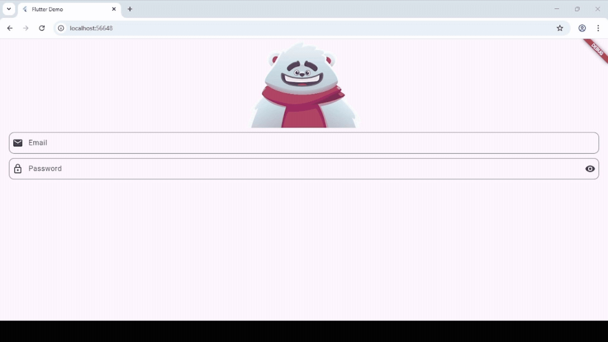

🐻✨ Interactive Login Animation App

Welcome to this project! This repository showcases the development of an interactive Login Screen Animation built with Flutter and powered by Rive.

The goal of this project is to create a dynamic and engaging login experience where animation reacts intelligently to user interaction. Instead of a static form, users interact with a character that responds in real time.

🚀 Project Overview

This application demonstrates how to integrate interactive animations into a Flutter project using Rive State Machines.

The login screen features a bear character that reacts depending on user actions:

👀 When the email field is selected, the bear looks toward the input area and follows the typing movement.

🙈 When the password field is selected, the bear covers its eyes.

🔐 The password is hidden by default and includes a toggle button to show/hide it.

⚠️ If there is an input error, the bear reacts with concern.

😄 If both fields are valid, the bear reacts with happiness.

This creates a more interactive and visually appealing authentication experience.

🎬 What is Rive?

Rive is a real-time interactive animation tool that allows developers and designers to create and implement responsive animations across multiple platforms.

Unlike traditional animations, Rive supports logic-driven animations through State Machines, enabling animations to react dynamically to user input.

🔄 What is a State Machine?

A State Machine in Rive is a system that controls how animations transition between different states depending on triggers, inputs, or conditions.

In this project, State Machines are used to:

Activate different animation states (idle, looking, covering eyes, happy, worried).

Respond to user focus changes.

Trigger reactions based on validation results.

They allow the animation to behave intelligently rather than playing a fixed sequence.

🛠️ Technologies Used

This project was developed using:

💙 Flutter – Google’s open-source framework for building cross-platform applications with a single codebase.

🎨 Rive – Tool for creating real-time interactive animations.

🧠 State Machines (Rive) – To control animation logic and transitions.

🎯 FocusNode – To detect when input fields gain or lose focus.

🔎 Regex (Regular Expressions) – For validating email input format.

👂 Listeners – To detect user interaction and state changes.

🎮 Controllers – To manage animation behavior and app logic.

💻 Visual Studio / VS Code – Development environment.

📂 Project Structure

Inside the lib folder, the project is mainly organized as follows:

main.dart

Entry point of the application.

Initializes and displays the Login Screen.

login_screen.dart

Contains the UI and core logic of the login screen.

Manages FocusNodes, animation controllers, listeners, and validation logic.

Connects Flutter inputs with Rive State Machine triggers.

This separation keeps the app organized and modular.

🎥 Demo

Below is a demonstration of the full login interaction:

📘 Course Information

Subject: Graphication
Professor: Rodrigo Fidel Gaxiola Sosa

🎨 Animation Credits

The interactive animation used in this project is based on the work of the Rive creator “dexterc”.

Original animation link:
https://rive.app/marketplace/3645-7621-remix-of-login-machine/

Full credit belongs to the original animation creator.

🌟 Final Thoughts

This project demonstrates how combining Flutter with Rive can transform a simple login form into an engaging and interactive user experience. By integrating animation logic with input validation and focus detection, we achieve a responsive interface that feels alive and modern.

Interactive design enhances usability — and makes development far more fun! 🚀
